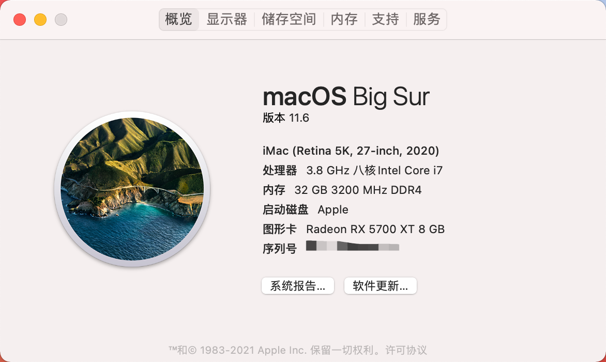

# Hackintosh-EFI-Z490A-i710700k-5700xt

如果需要参考我的安装过程及问题解决 [点击这里](https://fynil.cn/2020/12/Hackintosh/)

> 当前OpenCore版本 0.6.4

## 本机配置

| Type        | Detail                                         |
| ----------- | ---------------------------------------------- |
| CPU         | Intel i7 10700K                                |
| GPU         | Sapphire AMD RX 5700XT 8GB超白金               |
| MotherBoard | Asus ROG STRIX Z490-A Gaming 吹雪              |
| RAM         | 32G GSkill Trident Z Royal 3200MHz DDR4 16 * 2 |
| SSD         | Samsung NVMe 970 EVO Plus 500GB                |

