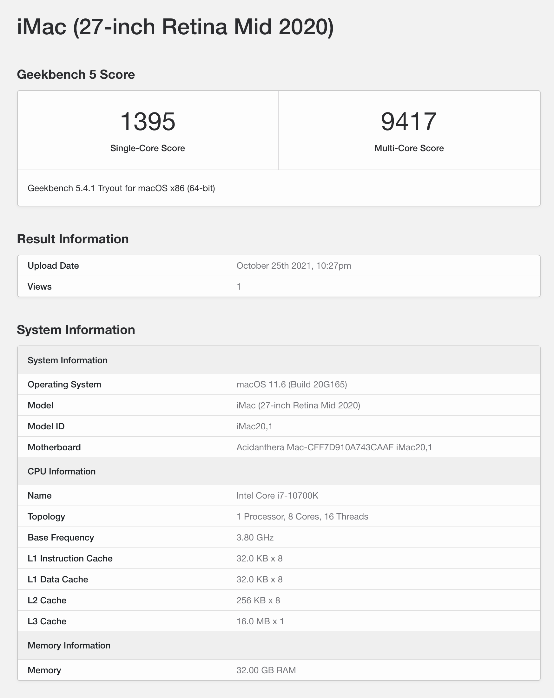

# Hackintosh-EFI-Z490A-i710700k-5700xt
> 当前OpenCore版本 0.6.4

## 本机配置

| Type        | Detail                                         |
| ----------- | ---------------------------------------------- |
| CPU         | Intel i7 10700K                                |
| GPU         | Sapphire AMD RX 5700XT 8GB超白金               |
| MotherBoard | Asus ROG STRIX Z490-A Gaming 吹雪              |
| RAM         | 32G GSkill Trident Z Royal 3200MHz DDR4 16 * 2 |
| SSD         | Samsung NVMe 970 EVO Plus 500GB                |

## 启动盘制作

- Mac环境
- 16G优盘

在AppStore下载BigSur， 打开Terminal终端， 输入以下命令

 `sudo /Applications/Install\ OS\ X\ BigSur.app/Contents/Resources/createinstallmedia --volume /Volumes/优盘名 --applicationpath /Applications/Install\ OS\ X\ BigSur.app —-nointeraction`

## SMBIOS 序列号生成

Do the following one line at a time in Terminal:

    git clone https://github.com/corpnewt/GenSMBIOS
    cd GenSMBIOS
    chmod +x GenSMBIOS.command

Then run with either `./GenSMBIOS.command` or by double-clicking *GenSMBIOS.command*

## EFI配置

#### 1. EFI分区

[MountEFI](https://github.com/corpnewt/MountEFI)

Do the following one line at a time in Terminal:

    git clone https://github.com/corpnewt/MountEFI
    cd MountEFI
    chmod +x MountEFI.command

Then run with either `./MountEFI.command` or by double-clicking *MountEFI.command*

#### 2. EFI配置

按照[OpenCore Install Guide](https://dortania.github.io/OpenCore-Install-Guide/prerequisites.html)配置EFI文件

**值得一提的是因为本机是华硕主板， 所以ACPI需要加入一个SSDT-RHUB.aml, 否则安装会失败**

- 一些ACPI说明
  - SSDT-PM.aml 可实现节能五项
  - SSDT-RHUB.aml 是为了解决Asus主板的一些问题
  - SSDT-RX 5700 XT-Version 1.0.aml 是优化5700xt的acpi

- Drivers
  - HfsPlus.efi 必须
  - OpenRuntime.efi 必须
  - AudioDxe.efi 开机钟声， 可不加
  - OpenCanopy.efi 启动界面美化， 可不加

⚠️ **增减ACPI、Drivers和Kexts的文件时， 需要在Config.plist相对应的位置做相应增减**

如果需要界面美化， 需要将Resources文件夹放到OC根目录下

| EFI - OC | Config.plist - Root |
| -------- | ------------------- |
| ACPI     | ACPI - Add          |
| Drivers  | UEFI - Drivers      |
| Kexts    | Kernel - Add        |

## 3. BIOS启动项配置

禁用

- fastboot
  - 启动 - 启动设置- 快速启动 - Disable
- 操作系统类型改为UEFI
- 禁用安全启动
  - 清除密钥即可

其他的Z490A主板默认即可符合OpenCore官方要求

### 4. 截图 Screenshoot

## 5. Trouble Shooting 问题解决

#### 1. 4K 60Hz

连接网络后无法4K 60hz显示

显示器： Dell 2718Q  线材 DP to miniDP

显示器设置里按住Option + 点击缩放， 就会出现刷新率选择

#### 2. 核显驱动

i7-10700K核显是 **Intel UHD 630**

按照OpenCore官方的配置

DeviceProperties-Add-PciRoot(0x0)/Pci(0x2,0x0) 
AAPL,ig-platform-id
<0300C89B>

貌似并没有驱动

#### 3. 有线网络

Asus ROG STRIX Z490-A Gaming 吹雪主板自带的有线网卡是**Intel-I225-V**

按照OpenCore官方在Config.plist - DeviceProperties 中添加device-id <F2150000>并没有作用
在此基础上添加了两个Kext才驱动了有线网卡,  config.plist要对应在Kernel里Add相应的Kext

* FakePCIID.kext
* FakePCIID_Intel_I225-V.kext

#### 4. Asus主板卡F1问题

在Config.plist 里搜索 DisableRtcChecksum 设置为1

如果还不行建议参照 [RTC综述 - Xjn’s Blog](https://blog.xjn819.com/post/rtc-issues-related-to-oc.html)

#### 5. 节能五项

添加了SSDT-PM.aml 并在Config.plist - ACPI中Add item

#### 6. 声卡问题

Asus ROG STRIX Z490-A Gaming 吹雪使用的是 **ROG SupremeFX 8** 声卡芯片， 好像是**Realtek ALCS1220A**的马甲

使用[Hackintool](https://github.com/headkaze/Hackintool)注入正确的ALC LayoutID即可

#### 7. 更改默认启动磁盘

1. 设置EFI文件夹 - OC - Config.plist   UEFI - Quirks - RequestBootVarRouting - 1 or YES
2. 系统偏好设置 - 启动磁盘 - 选择mac磁盘

#### 8 USB Map

Hackintool貌似插拔没反应， 暂时搁置

## 参考链接

装黑苹果的过程中， 一下链接给了很大帮助， 感谢！ Thanksssss 

[SMBIOS](https://github.com/corpnewt/GenSMBIOS)

[MountEFI](https://github.com/corpnewt/MountEFI)

[OpenCore Install Guide](https://dortania.github.io/OpenCore-Install-Guide/prerequisites.html)

[Hackintool](https://github.com/headkaze/Hackintool)

[USBMap](https://github.com/corpnewt/USBMap)

[使用 OpenCore 引导黑苹果 - Xjn’s Blog](https://blog.xjn819.com/post/opencore-guide.html)

[RTC综述 - Xjn’s Blog](https://blog.xjn819.com/post/rtc-issues-related-to-oc.html)